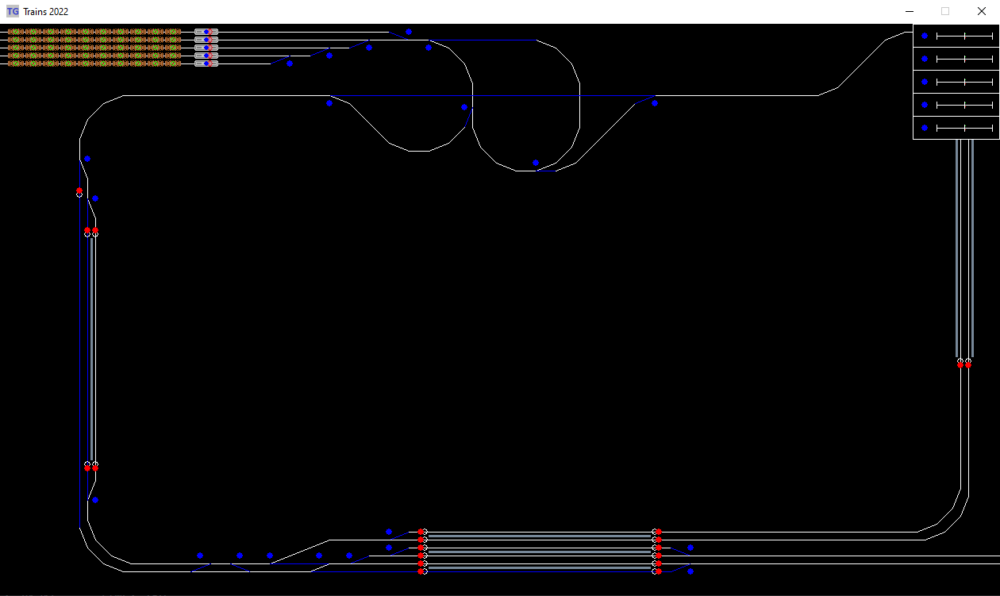

# Trains_2022
Railway traffic control simulator written in an object-oriented way

**Project still under development**

## Instruction
- To play **'Trains'**, run the file _main_Trains2.py_
- On the right side of the window there is a control panel to control the trains.

  

## To do list
- [x] Rewrite old code from Train_2015 in new object-oriented way
  - [x] Use Python with Pygame library
  - [x] Make space for the future open world map
  - [x] Draw trains with sprites
- [ ] Save map and all map-related data in database
- [ ] Add a feature allowing to build/modify the map
- [ ] Add procedurally generating algorithm for expanding map
- [ ] Add AI for train engineer
  - [x] Basic check if the track in front of the train is free
  - [x] Check semaphore
- [ ] Add AI for station master
  - [x] Add semaphores
